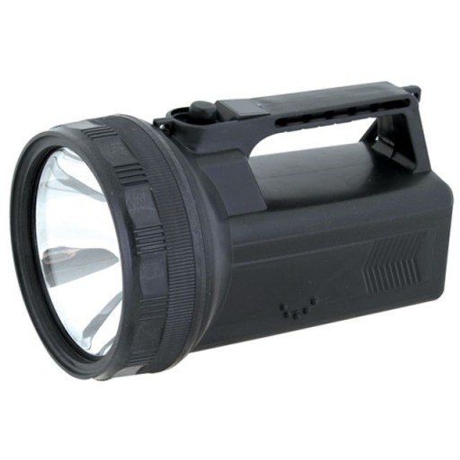

# 게임명 : <메모(Memo)>

[1. 컨셉](#컨셉)

[2. 관련 이미지 & 동영상](#관련-이미지--동영상)

[3. 대표 이미지](#대표-이미지)

[4. 컨셉 및 대표이미지 기반 작품 묘사](#컨셉-및-대표이미지-기반-작품묘사)

[5. "메모" 구성 요소](#메모-구성-요소)

- [a. 메커니즘](#a-메커니즘)

- [b. 이야기](#b-이야기)

- [c. 미적요소](#c-미적요소)

- [d. 기술](#d-기술)

[6. "메모" 게임시스템 디자인](#메모-게임시스템-디자인)

- [a. 게임 오브젝트 분해(구성 요소 분석)](#a-게임-오브젝트-분해구성-요소-분석)

- [b. 파라미터(속성) 뽑아보기](#b-파라미터속성-뽑아보기)

- [c. 행동 뽑아보기](#c-행동-뽑아보기)

- [d. 상태 뽑아보기](#d-상태-뽑아보기)

- [e. 플레이어 캐릭터 속성 (파라미터)](#e-플레이어-캐릭터-속성-파라미터)

- [f. 게임의 규칙](#f-게임의-규칙)

- [g. 게임에서 사용될 공식](#g-게임에서-사용될-공식)

[7. "메모" 개발 요구사항 & 흐름도](#메모-개발-요구사항--흐름도) 

- [a. 요구사항](#a-요구사항)

- [b. 시간별 흐름도(flowchart)](#b-시간별-흐름도flowchart)

- [c. 키보드 이벤트에 대한 흐름도](#c-키보드-이벤트에-대한-흐름도)

- [d. 용어정리](#용어정리)

[8. 개발작업 일정](#개발작업-일정)

# 개발 진행도
- [a. 1주차](./files/#week1/memo-개발-1주차)
- [b. 2주차](./files/#week2/memo-개발-2)

# [컨셉]
## 메인컨셉 : 탈출 
- 특정 공간에서 탈출을 한다.
- 장르 : 어드벤처, 탈출

### 서브 컨셉 1 : 문제
- 여러가지 문제를 풀면서 단서를 찾는다.
- 특정 아이템을 조합하며 난관을 헤쳐나간다.

### 서브 컨셉 2 : 스토리
- 주인공이 왜 이곳에 갇혀있는지 문제를 풀면서 스토리를 알아간다.
- 문제를 푸는 방식이나 단서에 따라 다른 스토리를 찾을 수 있다

### 서브 컨셉 3 : 힌트
- 문제를 풀다가 막힐 때, 혹은 단서를 찾기 힘들 때 사용한다.
- 무제한이 아닌 갯수에 제한을 둔다.

### 서브 컨셉 4 : 몰입감
- 소리나 배경을 통해 직접 그 자리에 있는것처럼 생생한 몰입감을 준다.

### 서브 컨셉 5 : 업데이트
- 탈출게임의 특성 상 풀었던 문제를 다시 풀기에는 재미가 반감 될 수가 있다.
- 새로운 스토리, 또는 스테이지를 업데이트해 플레이어가 흥미를 느낄 수 있도록 한다.

  
# [관련 이미지 & 동영상]
- 이미지  

- 동영상

  
# [대표 이미지]

  
# [컨셉 및 대표이미지 기반 작품묘사]

 

## 대표이미지 : 현재 아이템창의 상황과 플레이어가 보는 UI의 모양을 나타내고 있습니다.

 

## 컨셉 : 문제를 풀고, 단서를 찾으며 잃어버린 기억을 찾기위해 진행합니다.

  
# [<메모> 구성 요소]

 

## a. 메커니즘

[목표]
1) 여러가지 단서를 찾고 문제를 풀면서 탈출을 최종적인 목표로 한다.

2) 문제를 풀면서 나오는 지문을 통해 스토리를 유추할 수 있도록 한다.

[재미 요소]
1) 문제를 풀거나 주변 인테리어를 통해 스토리를 점점 깨닫게 된다.

2) 기억을 잃고 메모가 적혀있는 냉장고 및 가구 등 처음 시작부분은 내가 왜 이곳에 있는지부터 알아가게 되며 문제를 풀었을때 나오는 정답(생일, 습관)이나 문제속에 있는 지문(오늘도 어제 있었던 일이 기억이 나지않는다)으로 스토리를 깨닫게 된다.

3) 수리력, 창의력, 관찰력, 단서 조합력 등 다방면의 능력을 발휘해 문제를 풀어나간다.
 당신은 어제의 일이 기억이 나나요? x/y
 이 사람의 성별은 무엇인가요? m/w
 이 사람의 혈액형은 무엇인가요? a/b/o/ab
 이 사람의 옷 사이즈는 무엇인가요? s/m/l
 정답 : x-mas = 12월25일

4) 방 하나에서 끝나는 것이 아닌 다른 방으로 이동을 하며 문제를 풀 수 있다.
 -예전 방에 있던 메모를 통해 다음방에서 풀수있는 문제의 단서를 찾는다.
 -다시 처음방으로 돌아와서 기억의 조각을 찾아가며 문제를 푼다.
 -방을 여러 개 만들면서 여러가지 분위기전환(집 또는 야외까지 확장할수있는 가능성)

 

## b. 이야기

[시놉시스]  
오늘도 잠에서 깼다. 
하지만 내가 누구인지, 내가 왜 이곳에서 잠에서 깨어났는지 전혀 기억이 나지않는다. 
아픈 머리를 짓누르며 옆에 있는 탁자를 보니 나에 대한 정보가 쓰여져 있고 왜 기억이 나지않는지 적혀있다.
그리고 어떻게 내 기억을 찾아가야하는지, 내가 왜 이곳을 나가야하는지..

[모티브]  
영화 – 박사가 사랑한 수식에서 모티브를 따와 제작하게 되었습니다. 하루의 기억이 80분밖에 유지되지않는 박사에 대한 이야기로, 기억이 나지않는 사람의 탈출을 최종 목표로 두고있습니다.

[호기심]
 1. 처음 시작부터 어떻게 진행이 될 지 알려주지 않기때문에 플레이어가 직접 스토리를 파헤쳐가는 재미가 있습니다.
 2. 메모를 보며 문제를 풀고 문제에 대한 정답 및 지문을 보며 호기심을 유발합니다
 3. 기억을 잃었다는 점에서 왜 이곳에 갇혀 있는지 독창적이게 풀어나가고 내가 이곳에 자의인지 타의로 갇힌것 인지 반전을 주며 탈출을 합니다. 

 

## c. 미적요소

[배경] 
 -밋밋한 하얀 방, 검은 방 등이 아닌 인테리어 및 주변 배경에 신경을 쓰어 직접 플레이를 하는 것 같은 몰입감을 줍니다.
 -사실적인 집, 야외 또는 사소한 가구들에 초점을 두어 기억을 찾기 위해 신경을 쓰도록 합니다.

[음향]  
단서를 발견했을 때, 게임의 중요한 분기점(집->야외 / 엔딩이 바뀔 수 있는 문제)을 넘었을 때, 또는 사소한 문 여는 소리, 무언가를 밟는 소리 등 여러가지 사운드를 통해 재미를 줍니다.

[가시적]
대표 이미지에 나와있는 아이템, 설명, 힌트, 지도 등 ui는 최대한 플레이어가 간편하고 한눈에 알아 볼 수 있게끔 가시적인 것에 신경을 씁니다. 특히 아이템같은 경우에는 여러가지 아이템을 얻을 수 있는 만큼 사소한 것(조합, 분해 등)에도 신경을 쓰고 힌트도 최대한 플레이어가 이해를 할 수 있게끔 정확하게 줍니다.

	
 

## d. 기술  
유니티 3D 엔진을 이용한 1인칭 게임

  
# [<메모> 게임시스템 디자인]

 

## a. 게임 오브젝트 분해(구성 요소 분석)

- 이미지  
1. 문제
 

2. 자물쇠
 

3. 집 내부
 

4. 열쇠
 

5. 메모지
 

6. 서랍장
 

7. 지도
 

8. 가구들
 

9. 아이템들
 

 
 

## b. 파라미터(속성) 뽑아보기

 

### 1. 플레이어
- 이동속도 : 1 (뛰고있을때 5)
- 크기 : 175cm의 백인
- 상태 : 기억을 잃은상태(찾아가는중)

### 2. 문제
- 크기 : 일반 포스트잇 크기(5x5)부터 A4용지 크기까지
- 색상 : 대부분 흰색, 또는 노란색의 메모지에 쓰여있다
- 위치 : 집 내부의 서랍장, 가구들 속

### 3. 자물쇠
- 크기 : 작음(열쇠와 크기가 맞도록 여러가지 자물쇠 설계)
- 개폐 : 처음에는 닫혀있다가 문제를 풀거나 열쇠를 찾으면 열림
- 색상 : 검정, 회색, 갈색

### 4. 집 내부
- 크기 : 24평의 평범한 가정집
- 내부 : 여러 가구들이 배치되어있다

### 5. 열쇠
- 크기 : 자물쇠에 들어갈만한 열쇠(자물쇠 크기에 맞도록 설계)
- 색상 : 자물쇠랑 똑같은 색상

### 6. 메모지
- 크기 : 5x5 포스트잇 일반 크기
- 색상 : 노란색, 흰색
- 재질 : 종이

### 7. 서랍장
- 크기 : 1x4의 4단 서랍장 또는 3x3의 옷장크기
- 색상 : 갈색

### 8. 지도
- 크기 : A4용지 크기(210X297)(mm)
- 색상 : 검정색

### 9. 랜턴
- 크기 : 10 x 5(cm)
- 색상 : 검정색
- 무게 : 100g 이내

### 10. 가구들
- 크기 : 각 가구에 맞게끔 집안에 들어갈 수 있는 크기
- 색상 : 냉장고(흰색) TV(검은색) 벽시계(검정or갈색) 식탁(갈색) 등등

 
 

## c. 행동 뽑아보기

### 1. 플레이어
- 걷기 : 1의 이동속도로 걸어다닌다.
- 뛰기 : 5의 이동속도로 뛰어다닌다.
- 조사하기 : 문제, 아이템을 조사한다.

### 2. 자물쇠
- 닫힌상태 : 아직 열리지않은 자물쇠 상태
- 열린상태 : 문제를 풀거나 열쇠를 사용해 자물쇠를 연 상태

### 3. 아이템
- 조사하기 : 아이템을 조사할 수 있는 상태
- 사용하기 : 플레이어가 아이템을 사용할 때 ex)랜턴을 킨다, 글씨를 쓴다

### 4. 지도
- 사용하기 : 현재 위치 및 전체 위치 확인
- 접기 : 지도를 다시 아이템창으로 넣는다

 
 

## d. 상태 뽑아보기

### 1. 플레이어
- 걷기 -> 뛰기 : 플레이어가 shift키로 달리기를 사용했을 때
- 뛰기 -> 걷기 : 플레이어가 shift키를 떼고 걷기를 사용했을 때
- 걷기 -> 조사하기 : 플레이어가 아이템이나 자물쇠를 발견 후 조사할 때
- 걷기 -> 사용하기 : 플레이어가 아이템을 사용할 때

### 2. 자물쇠
- 닫힌상태 -> 열린상태 : 플레이어가 자물쇠를 열었을 때

### 3. 아이템
- 기본 -> 사용 : 플레이어가 아이템을 사용했을 때
- 사용 -> 소멸 : 플레이어가 아이템을 일회성 아이템을 사용 했을 때

 
 

## e. 플레이어 캐릭터 속성 (파라미터)

### 이동(Move)
- 플레이어가 걷고 있을 때
 

### 달리기(Run)
- 플레이어가 뛰고 있을 때
 

### 아이템사용(UseItem)
- 플레이어가 아이템이나 자물쇠를 사용할 때
 

### 조사하기(investigate)
- 플레이어가 아이템이나 문제를 조사할 때

### 힌트사용하기(UseHint)
- 플레이어가 힌트를 사용하고 싶을 때

 
 

## f. 게임의 규칙

- ### 핵심 규칙
#### 1. 플레이어는 문제를 풀고 단서를 찾으며 기억을 찾아나간다.
#### 2. 메모를 통해 저장을 할수 있다.
#### 3. 기억을 찾으며 여러가지 엔딩을 확인할 수 있다.

 

- ### 보조 규칙
#### 1. 플레이어는 힌트를 한 게임동안 최대 5번 사용할 수 있다.
#### 2. 주어진 문제를 다 풀어야 엔딩을 볼 수 있다.

 
 

## g. 게임에서 사용될 공식

### 1. 아이템을 사용했을 때 맞는 위치에 사용된 아이템이면 아이템이 사용(UseItem)되고 그렇지 않다면 아이템이 사용되지않는다.
### 2. 플레이어는 걷기 -> 뛰기 전환이 자유롭다(Shift키 사용)
### 3. 각 문제마다 힌트를 넣어놓고 플레이어가 자유롭게 사용가능(최대 5번 / UseHint)

  

# [<메모> 개발 요구사항 & 흐름도]

 

## a. 요구사항
 

### 요구사항(1년)

-  시작화면, 설정화면, 엔딩보기, 게임화면, 불러오기 총 5개의 화면이 있다.
-  시작화면에서는 게임시작, 설정화면, 엔딩보기, 불러오기 버튼 4개가 있다.
-  설정화면은 사운드 설정이 가능하며, 뒤로 돌아갈 수 있는 버튼이 있다.
-  엔딩보기는 지금까지 확인한 엔딩을 확인할 수 있으며, 뒤로 돌아갈 수 있는 버튼이있다.
-  불러오기는 가장 최근에 저장했던 플레이 시간으로 이동하여 게임을 진행할 수 있다.
-  게임화면에서는 오른쪽 위에는 힌트창, 왼쪽 위에는 아이템창이 표시된다.
-  힌트의 사용은 플레이어가 자유롭게 사용이 가능하며 최대 5개까지 사용이 가능하다.
-  플레이어가 힌트창에서 힌트를 사용할 시 화면 중앙에 다음에 진행해야하는 문제에 대한 힌트, 또는 해야하는 행동에 대한 단서가 나온다.
-  아이템은 아이템창에서 사용할 수 있으며, 플레이어가 아이템창에서 아이템을 사용할 시 아이템창이 닫히며 플레이어가 사용하고 싶은곳에 아이템을 사용할 수 있다.
-  올바른 곳에 아이템이 사용되면 일회성 아이템일 경우(열쇠, 병, 녹슨 망치 등) 사라지며, 일회성 아이템이 아닌 경우(가위, 펜, 지도 등)는 다시 아이템창에서 사용이 가능하다.
- 게임화면에서 3d 형식으로 플레이어가 돌아다닐 수 있다.
- 조작방식은 키보드의 WASD로 움직이며 shift 키를 이용해 빨리 달릴수 있고 마우스 왼쪽버튼으로 조사 및 아이템을 사용할 수 있다.
-  문제의 정답은 키보드로 입력할 수 있다.
-  서랍 문을 열거나, 방 문을 여는 등의 행동은 마우스 왼쪽버튼을 클릭해 할 수 있다.
-  조사하기는 아이템이나 문제가 있는곳에서 마우스 왼쪽버튼을 클릭해 할 수 있다.
-  푼 자물쇠는 더이상 사용이 불가능하며 사라진다.
-  게임도중 ESC를 통해 사운드를 설정할 수 있다.
-  게임을 종료할 때 게임화면에서 침실로 돌아가 침대옆의 메모지에 가장최근에 풀었던 문제, 단서를 기록하며 저장한다.
-  게임 종료 조건은 마지막 문제를 풀고, 기억을 찾게 되면 게임이 종료되며 엔딩을 볼 수 있다.

### 요구사항(6주)
- 시작화면, 설명화면, 게임화면 총 3개의 화면이 있다.
- 시작화면에서는 오른쪽위에 설정화면, 중앙에 게임시작 버튼이 있다.
- 설정화면에서는 사운드 설정이 가능하며, 뒤로 돌아갈 수 있는 버튼이 있다.
- 게임시작을 누르면 플레이어는 침대에서 시작한다.
- 조작법은 W(앞으로가기) , A(왼쪽), S(뒤), D(오른쪽), 마우스 왼쪽클릭(상호작용), ESC(설정), SHIFT(달리기)으로 조작할수 있다.
- 집안에 가구가 배치되어 있으며 메모가 여러개 붙어있다.
- 게임화면에서는 왼쪽위에 아이템창이 나온다.
- 게임화면에서 움직이면서 아이템을 찾거나 단서를 활용해 스토리를 진행한다.
- 저장을 위해서는 침대에 돌아와 메모를 작성함으로써 저장이 가능하다.
- 집 안을 돌아다니면서 문제를 풀 수 있고 문제는 가구에 메모로 붙어있다던지, 열쇠로 잠겨있는 자물쇠를 열쇠를 찾거나, 번호키로 되어있는 자물쇠를 돌려서 열 수 있다.
- 게임진행 중 배경음악, 아이템을 상호작용 했을때 효과음, 엔딩 때 나오는 음악이 나온다.

  

## b. 시간별 흐름도(flowchart)

  

## c. 키보드 이벤트에 대한 흐름도

  

## d. 용어정리

  

  

## 8. 개발작업 일정

 

### 1주차

- 스토리 제작(시작 스토리 ~ 엔딩 스토리)
- 플레이어 이동(W,A,S,D)
- 문제 제작
- 시작화면 제작(설정화면,게임시작 버튼)
- 게임화면 제작(전체적인 배경)
- 설정화면 제작(SOUND 설정 버튼)

### 2주차
- 맵 프로그래밍(집 내부)
- 아이템 프로그래밍 - 기본적인 아이템(가위,칼,열쇠,자물쇠,펜 등등)
- 문제 제작
- 플레이어 이동(SHIFT)
- 충돌 체크
- 게임화면 제작(침실)
- 인테리어 제작(침실 인테리어)
- 아이템 그래픽 - 기본적인 아이템
- 플레이어 에니메이션 제작
- 배경음악 제작

### 3주차
- 맵 프로그래밍(집 내부)
- 아이템 프로그래밍 - 플레이어와의 상호작용(열쇠로 자물쇠열기, 가위로 종이자르기 등)
- 문제 제작
- 충돌 체크
- 게임 화면 제작(거실)
- 인테리어 제작(거실 인테리어)
- 아이템 그래픽 - 기본적인 아이템(랜턴, 망치, 컴퓨터, 메모지 등등)
- 플레이어 에니메이션 제작
- 아이템 상호작용 음악 제작

### 4주차
- 맵 프로그래밍(집 내부)
- 아이템 프로그래밍 - 플레이어와의 상호작용
- 충돌 체크
- 게임화면 제작(욕실, 나머지 방)
- 인테리어 제작(욕실 인테리어)
- 아이템 그래픽 - 완성되지 않은 아이템
- 엔딩음악 제작

### 5주차
- 맵 프로그래밍(집 내부 마무리, 집 외부 날씨OR밤낮)
- 아이템 프로그래밍 마무리
- 충돌 체크
- 인테리어 제작(집 내부 인테리어 마무리)

### 6주차
- 전체적인 프로그래밍 마무리
- 충돌 체크 마무리
- 인테리어 그래픽 마무리
- 동영상 제작
