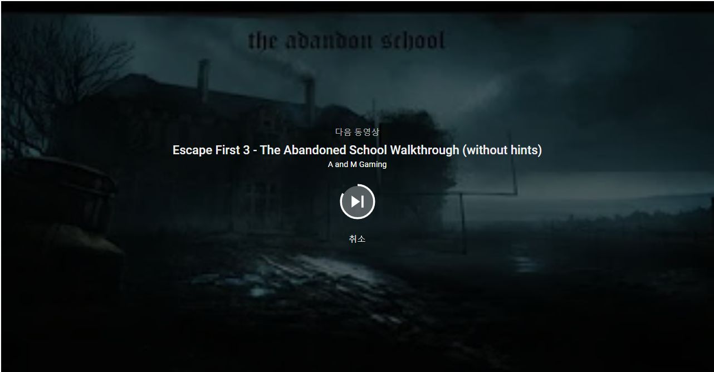

# [<메모(Memo)> 컨셉]
## 메인컨셉 : 
- 특정 공간에서 탈출을 한다.
- 장르 : 어드벤처, 탈출

### 서브 컨셉 1 : 문제
- 여러가지 문제를 풀면서 단서를 찾는다.
- 특정 아이템을 조합하며 난관을 헤쳐나간다.

### 서브 컨셉 2 : 스토리
- 주인공이 왜 이곳에 갇혀있는지 문제를 풀면서 스토리를 알아간다.
- 문제를 푸는 방식이나 단서에 따라 다른 스토리를 찾을 수 있다

### 서브 컨셉 3 : 힌트
- 문제를 풀다가 막힐 때, 혹은 단서를 찾기 힘들 때 사용한다.
- 무제한이 아닌 갯수에 제한을 둔다.

### 서브 컨셉 4 : 몰입감
- 소리나 배경을 통해 직접 그 자리에 있는것처럼 생생한 몰입감을 준다.

### 서브 컨셉 5 : 업데이트
- 탈출게임의 특성 상 풀었던 문제를 다시 풀기에는 재미가 반감 될 수가 있다.
- 새로운 스토리, 또는 스테이지를 업데이트해 플레이어가 흥미를 느낄 수 있도록 한다.

  
# [관련 이미지 & 동영상]
- 이미지  

- 동영상

  
# [대표 이미지]

  
# [<메모(Memo)> 구성 요소]

 

## 1. 메커니즘

[목표]
1) 여러가지 단서를 찾고 문제를 풀면서 탈출을 최종적인 목표로 한다.

2) 문제를 풀면서 나오는 지문을 통해 스토리를 유추할 수 있도록 한다.

[재미 요소]
1) 문제를 풀거나 주변 인테리어를 통해 스토리를 점점 깨닫게 된다.

2) 기억을 잃고 메모가 적혀있는 냉장고 및 가구 등 처음 시작부분은 내가 왜 이곳에 있는지부터 알아가게 되며 문제를 풀었을때 나오는 정답(생일, 습관)이나 문제속에 있는 지문(오늘도 어제 있었던 일이 기억이 나지않는다)으로 스토리를 깨닫게 된다.

3) 수리력, 창의력, 관찰력, 단서 조합력 등 다방면의 능력을 발휘해 문제를 풀어나간다.
 당신은 어제의 일이 기억이 나나요? x/y
 이 사람의 성별은 무엇인가요? m/w
 이 사람의 혈액형은 무엇인가요? a/b/o/ab
 이 사람의 옷 사이즈는 무엇인가요? s/m/l
 정답 : x-mas = 12월25일

4) 방 하나에서 끝나는 것이 아닌 다른 방으로 이동을 하며 문제를 풀 수 있다.
 -예전 방에 있던 메모를 통해 다음방에서 풀수있는 문제의 단서를 찾는다.
 -다시 처음방으로 돌아와서 기억의 조각을 찾아가며 문제를 푼다.
 -방을 여러 개 만들면서 여러가지 분위기전환(집 또는 야외까지 확장할수있는 가능성)

 

## 2. 이야기

[시놉시스]  
오늘도 잠에서 깼다. 
하지만 내가 누구인지, 내가 왜 이곳에서 잠에서 깨어났는지 전혀 기억이 나지않는다. 
아픈 머리를 짓누르며 옆에 있는 탁자를 보니 나에 대한 정보가 쓰여져 있고 왜 기억이 나지않는지 적혀있다.
그리고 어떻게 내 기억을 찾아가야하는지, 내가 왜 이곳을 나가야하는지..

[모티브]  
영화 – 박사가 사랑한 수식에서 모티브를 따와 제작하게 되었습니다. 하루의 기억이 80분밖에 유지되지않는 박사에 대한 이야기로, 기억이 나지않는 사람의 탈출을 최종 목표로 두고있습니다.

[호기심]
 1. 처음 시작부터 어떻게 진행이 될 지 알려주지 않기때문에 플레이어가 직접 스토리를 파헤쳐가는 재미가 있습니다.
 2. 메모를 보며 문제를 풀고 문제에 대한 정답 및 지문을 보며 호기심을 유발합니다
 3. 기억을 잃었다는 점에서 왜 이곳에 갇혀 있는지 독창적이게 풀어나가고 내가 이곳에 자의인지 타의로 갇힌것 인지 반전을 주며 탈출을 합니다. 

 

## 3. 미적요소

[배경] 
 -밋밋한 하얀 방, 검은 방 등이 아닌 인테리어 및 주변 배경에 신경을 쓰어 직접 플레이를 하는 것 같은 몰입감을 줍니다.
 -사실적인 집, 야외 또는 사소한 가구들에 초점을 두어 기억을 찾기 위해 신경을 쓰도록 합니다.

[음향]  
단서를 발견했을 때, 게임의 중요한 분기점(집->야외 / 엔딩이 바뀔 수 있는 문제)을 넘었을 때, 또는 사소한 문 여는 소리, 무언가를 밟는 소리 등 여러가지 사운드를 통해 재미를 줍니다.

[가시적]
대표 이미지에 나와있는 아이템, 설명, 힌트, 지도 등 ui는 최대한 플레이어가 간편하고 한눈에 알아 볼 수 있게끔 가시적인 것에 신경을 씁니다. 특히 아이템같은 경우에는 여러가지 아이템을 얻을 수 있는 만큼 사소한 것(조합, 분해 등)에도 신경을 쓰고 힌트도 최대한 플레이어가 이해를 할 수 있게끔 정확하게 줍니다.

	
 

## 4. 기술  
유니티 3D 엔진을 이용한 1인칭 게임
